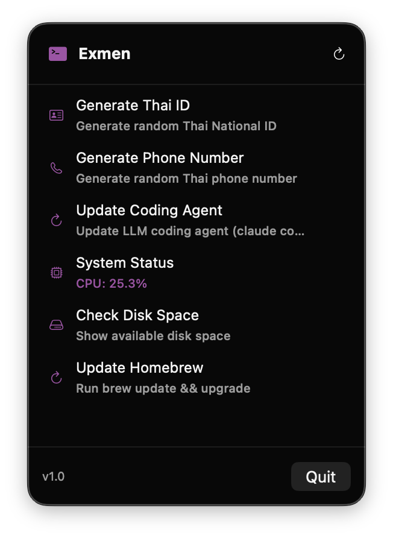

<p align="center">
  
</p>

<h1 align="center">Exmen</h1>

<p align="center">
  A macOS menu bar app for zero-friction script execution. Click, run, done.
</p>

<p align="center">
  
  
  
</p>

<p align="center">
  
</p>

## What is Exmen?

Exmen lives in your menu bar and lets you run scripts without switching to Terminal. Define actions in simple TOML files, click to execute, and get results via clipboard, notification, or popup.

**Core value:** Zero-friction execution — click menu, run action, done.

## Features

- **Menu Bar App** — Always accessible, never in the way
- **TOML Configuration** — Human-readable action definitions
- **Auto-Discovery** — Drop a `.toml` file, it appears instantly
- **Multiple Output Handlers**
  - `clipboard` — Copy output to clipboard
  - `notification` — Show macOS notification
  - `popup` — Display in a result window
- **Hook System** — Scripts can update their display dynamically
- **Status Polling** — Periodic status updates for monitoring actions
- **CLI Tool** — Integrate with external tools via `exmen` command
- **Global Config** — Control action ordering and enable/disable

## Installation

### Download

Download the latest release from [GitHub Releases](https://github.com/noomz/exmen/releases):

- **DMG** — Open, drag Exmen to Applications
- **ZIP** — Extract, move Exmen.app to Applications

### Build from Source

```bash
git clone https://github.com/noomz/exmen.git
cd exmen
xcodebuild -project Exmen.xcodeproj -scheme Exmen -configuration Release build
```

The built app will be in `~/Library/Developer/Xcode/DerivedData/Exmen-*/Build/Products/Release/Exmen.app`

### Requirements

- macOS 13.0 (Ventura) or later
- Xcode 15.0+ (for building)

## Quick Start

Copy the example configs to get started:

```bash
cp -r .config/exmen ~/.config/
```

This includes:
- `config.toml` — Global configuration example
- `actions/system-status.toml` — CPU monitoring with status polling
- `actions/check-disk-space.toml` — Disk space notification
- `actions/update-homebrew.toml` — Brew update with popup output

## Configuration

Actions are defined in TOML files located at `~/.config/exmen/actions/`

### Basic Action

```toml
name = "Generate Phone Number"
icon = "phone"
description = "Generate random phone number"

[script]
type = "inline"
content = """
#!/bin/bash
echo "08$(shuf -i 10000000-99999999 -n 1)"
"""

[output]
handler = "clipboard"
```

### Action with External Script

```toml
name = "Update Homebrew"
icon = "arrow.clockwise"
description = "Run brew update && upgrade"

[script]
type = "file"
path = "~/.config/exmen/scripts/update-brew.sh"

[output]
handler = "popup"
```

### Action with Hooks (Dynamic Updates)

```toml
name = "System Status"
icon = "cpu"
description = "Monitor CPU usage"

[script]
type = "inline"
content = """
#!/bin/bash
echo "CPU: $(top -l 1 | grep 'CPU usage' | awk '{print $3}')"
"""

[output]
handler = "notification"

[hook]
poll_interval = 30
parse_output = true

[hook.status_script]
type = "inline"
content = """
#!/bin/bash
cpu=$(top -l 1 | grep "CPU usage" | awk '{print $3}')
echo "EXMEN:status=CPU: $cpu"
"""
```

## Hook System

Scripts can emit special lines to update their action's display:

```
EXMEN:title=New Title
EXMEN:status=Current status text
EXMEN:badge=NEW
EXMEN:icon=star.fill
```

These lines are parsed and removed from the output. The action's UI updates accordingly.

## CLI Tool

Exmen includes a command-line interface for integration with external tools (like sketchybar, scripts, etc.):

```bash
# List all actions
exmen list-actions

# Run an action by name
exmen run "Generate Phone Number"

# Get action status
exmen status "System Status"
```

The CLI communicates with the running Exmen app via Unix domain socket at `~/.config/exmen/exmen.sock`.

### Installation

Copy the CLI to your PATH:

```bash
cp /Applications/Exmen.app/Contents/MacOS/exmen /usr/local/bin/
```

## Global Configuration

Control action ordering and visibility in `~/.config/exmen/config.toml`:

```toml
# Display order (unlisted actions appear at the end)
order = [
    "Generate Thai ID",
    "Generate Phone Number",
    "System Status",
]

# Hide actions without deleting their config files
disabled = [
    "Update Homebrew",
]
```

## Configuration Reference

### Action Fields

| Field | Type | Required | Description |
|-------|------|----------|-------------|
| `name` | string | Yes | Display name |
| `icon` | string | No | SF Symbol name (default: "terminal") |
| `description` | string | No | Shown below the name |
| `hide_on_click` | bool | No | Close menu after clicking (default: true) |

### Script Configuration

| Field | Type | Required | Description |
|-------|------|----------|-------------|
| `script.type` | string | Yes | `"inline"` or `"file"` |
| `script.content` | string | For inline | The script content |
| `script.path` | string | For file | Path to script file |

### Output Configuration

| Field | Type | Required | Description |
|-------|------|----------|-------------|
| `output.handler` | string | No | `"clipboard"`, `"notification"`, or `"popup"` (default: "clipboard") |

### Hook Configuration

| Field | Type | Required | Description |
|-------|------|----------|-------------|
| `hook.poll_interval` | int | No | Seconds between status script runs (default: 60) |
| `hook.parse_output` | bool | No | Parse EXMEN: lines from output (default: true) |
| `hook.status_script` | object | No | Script config for status updates |

## Project Structure

```
Exmen/
├── ExmenApp.swift           # App entry point
├── Models/
│   ├── Action.swift         # Action model
│   ├── ActionConfig.swift   # TOML config models
│   ├── GlobalConfig.swift   # Global settings model
│   ├── HookUpdate.swift     # Hook system models
│   └── ScriptResult.swift   # Execution result
├── Views/
│   ├── MenuContentView.swift
│   ├── ActionRowView.swift
│   └── PopupResultView.swift
├── Services/
│   ├── ActionService.swift   # Action management
│   ├── ConfigLoader.swift    # TOML loading
│   ├── DirectoryWatcher.swift
│   ├── ScriptRunner.swift    # Script execution
│   ├── OutputService.swift   # Output handling
│   ├── HookParser.swift
│   ├── StatusPoller.swift
│   └── IPCServer.swift       # Unix socket server
├── CLI/
│   └── main.swift            # CLI tool entry point
└── Assets.xcassets/
    └── AppIcon.appiconset/
```

## License

MIT License. See [LICENSE.md](LICENSE.md) for details.

## Contributing

Contributions are welcome! Please feel free to submit a Pull Request.
